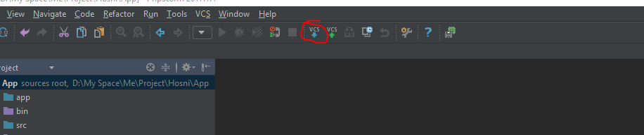
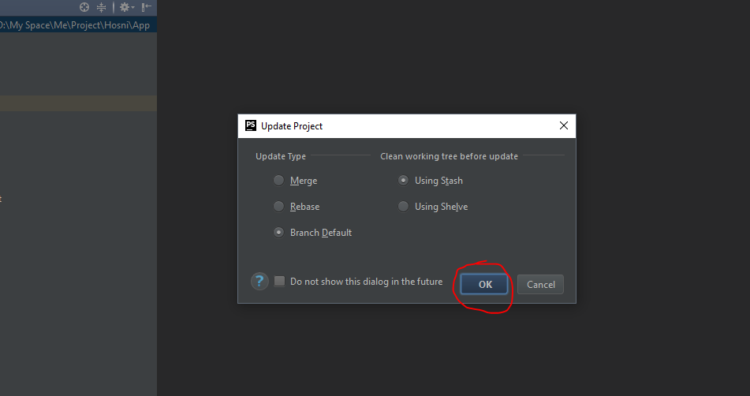

Installation du projet
=========

.1) **update de repository**
 
1 
 ---
 
2 
---

.2) **update d'application**

Installer [composer](https://getcomposer.org/download/ "composer")

Puis update projet:
```
composer install
```
Après configurer votre projet avec `parameters.yml` dans le `app/config` par:
  
```
#app/config/parameters.yml

parameters:
    database_host: 127.0.0.1
    database_port: 3306
    database_name: app_bd
    database_user: root
    database_password: null # password for data base
    mailer_transport: smtp
    mailer_host: 127.0.0.1
    mailer_user: app
    mailer_password: app
    ...
```

.3) Créer et Update Base de Donnée

````
php bin/console doctrine:database:create
````
```
php bin/console doctrine:schema:drop --full-database --force 
```
```
php bin/console doctrine:schema:update --force
```

```
php bin/console doctrine:fixtures:load
```

.4) Installez les assets du bundles
```
php bin/console assets:install
```

.5) Run application
```
php bin/console server:run
```
Visiter `http://127.0.0.1:8000/` 